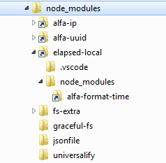

# node-modules-prod
### prepare `node_modules` for production, convert symlinks, remove clutter

## why
`node_modules` packages contain a lot of clutter, test folders, examples, documentation etc. Production site will never use them. Local packages on DEV are stored as symbolic links in `node_modules` - great for development, but `npm install` on PROD  will leave them as symbolic links, which will be broken once pushed to server.  

This utility will:
- convert symlinks folders to actual folders
- strip unneeded files and folders to bare minimum (`Raspberry Pi` friendly)
- ignore packages listed as devDependencies 
## gulp use example
```javascript
const copyNodeModules = require('node-modules-prod');

var dest = 'BUILD';

function cb(){console.log('done.');}

gulp.task('copy-node-modules', function(cb){

    copyNodeModules(
        './',        // sourceRoot relative to DEV root
        dest,        // destinationRoot relative to DEV root
        {},          // use default options
        cb           // callback for gulp task
    );
});
```
### default options
```javascript
    quiet: true             // do not show progress in console, (progress shows only folder names)
    noDevDependencies: true,// do not copy devDependencies (as per package.json)
    useNpmignore: true,     // use npmignore file in each folder to exclude files
    packageDir:''           // dir name for package.json when not in dev root
    noIgnoreList: false     // use ignore.js list
    logIgnored: false       // do not show ignored items in console (in magenta color)
 ```
### NOTE:
The `node-modules-prod` only copies  existing folders form DEV `node_modules` to BUILD folder.  
1. Run `npm install` in DEV, to make sure that all your dependencies in `node_modules` are in working order.
2. Make sure not to change default options to exclude unneeded folders and files from copying:
```javascript
noDevDependencies: true,    // do not copy devDependencies (form package.json)
useNpmignore: true,         // use npmignore file in each folder to exclude files
```
3. If symlinks are in `package.json`, do NOT run `npm install` in BUILD folder!
4. The `node-modules-prod` aggresively excludes unneeded files saving a lot of space. Excluded files can be listed in console (magenta color) with `<-` mark by using `logIgnored:true` option. Exclusion list is in [ignore.js](igonre.js) file. Readme and License files are excluded too. Check licensing requirements for each package.

## when `node_modules` and `package.json` is in a subfolder of dev root folder
add `options.packageDir=subfolderName` to tell where to look for `package.json` otherwise devDependencies exclusion will not work.
```javascript
const copyNodeModules = require('node-modules-prod');
var dest = 'BUILD';

gulp.task('copy-npm-modules', function(cb){

    copyNodeModules(
        './subfolderName',              // sourceRoot relative to DEV root
        dest,                           // destinationRoot relative to DEV root
        'node_modules',                 // dirName
        {                               // options:
            packageDir: 'subfolderName';// tell that package.json is in this subfolder
        }, 
        cb                              // callback for gulp task
    );
});
```
## console
copying progress is shown in console  with options `{quiet:false}` only folders are shown. (there are too many files to show)
```javascript
source -> destionation      // default color 
ignored <-                  // magenta {logIgnored:true}
symbolicLink => folder      // blue
```

## aboul symbolic links
To check if you have symbolic links in node_modules, look for little link arrows on the folder icon in file explorer:  
  

## bower_components
to remove unneeded files and folders from `bower_components` try [bower-purge](https://www.npmjs.com/package/bower-purge).   
[Polymer 2](https://www.polymer-project.org/2.0/docs/devguide/feature-overview) components are great! Don't bother with Polymer 3 (for C!# or C--).
## requirements
NodeJS v8 and gulp v3 (tested on Win7)
